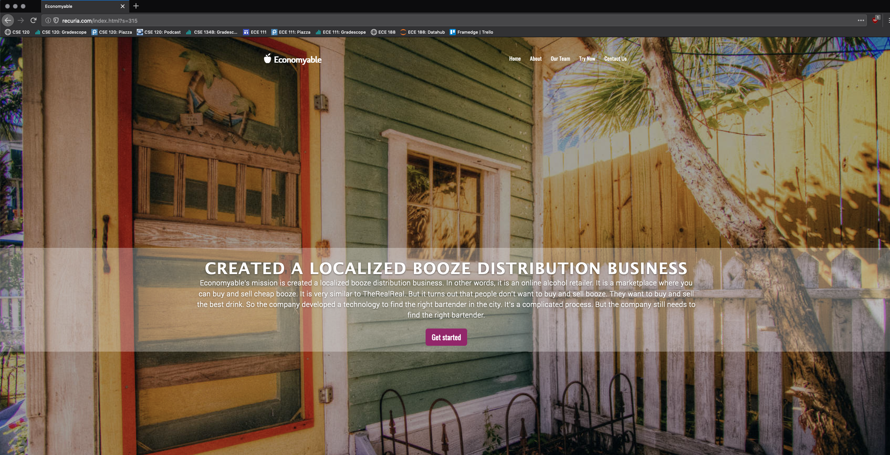
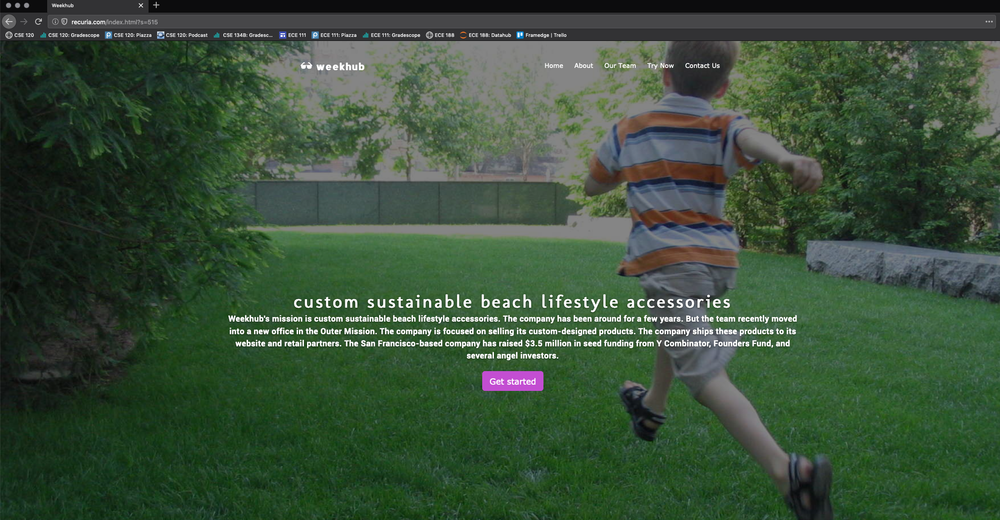
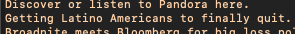
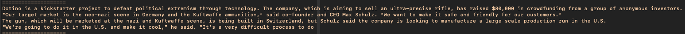
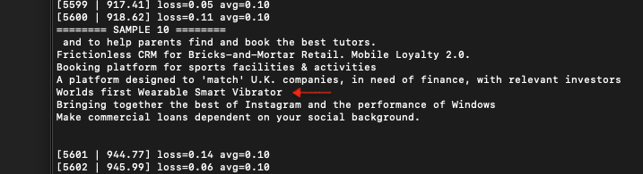
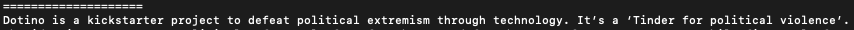
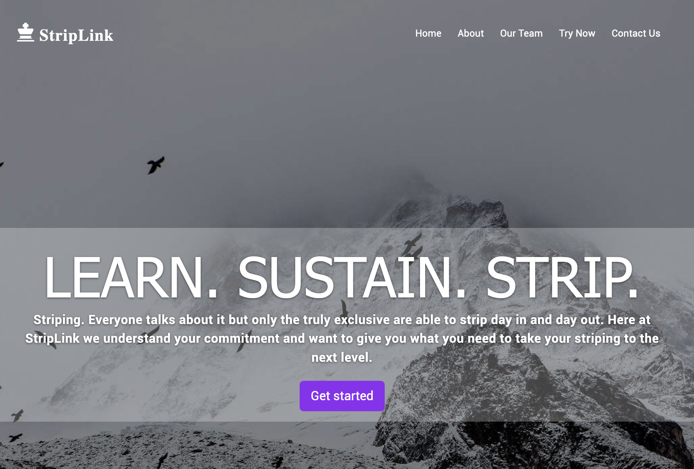

# Project 1 Generative Text

Winson Luk, wluk@ucsd.edu

## Abstract

Every startup claims to be disrupting an industry or changing the world. Most startup ideas are destined to fail, but some truly change the world. By training on thousands of startup taglines, articles, and interviews, this project aims to generate a lot of bad startup ideas, and a few good ones.

Most startup ideas can be summarized in just one paragraph. The tagline describes the overarching concept (e.g., "Uber is finding you better ways to move, work, and succeed"), and the next few sentences can provide a more detailed description of the product, as well as context on the startup's history, people, and industry.

The tagline can be created by finetuning GPT-2 with a dataset of startup taglines, and the subsequent sentences can be generated by feeding this tagline as a prefix into a second GPT-2 model finetuned with company analyses (e.g., most TechCrunch articles).

The ideas generated have been fairly realistic (most are bad, some are good), so there are plans to incorporate these results into a faux startup website similar to https://tiffzhang.com/startup, with a few million permutations of ideas. And with that many ideas, there might be one in there that could actually change the world.

## Model/Data

- I created two models, both finetuned with the gpt-2-simple library.
- The first model is trained on startup taglines from [Startups List](https://www.startups-list.com/). I used Rick Hennessy's [scraped dataset](https://data.world/rickyhennessy/startup-names-and-descriptions).
- The second model is trained on TechCrunch posts, which focus on the latest developments in technology. The scraped data is from [Kaggle](https://www.kaggle.com/thibalbo/techcrunch-posts-compilation).
- https://winsonluk.com/assets/gpt.zip
- https://winsonluk.com/assets/ideas.zip

## Code

- https://github.com/winsonluk/gpt_pitches
- https://github.com/winsonluk/gpt_descriptions
- https://github.com/winsonluk/gpt_summaries

## Results

- http://recuria.com
- https://github.com/winsonluk/gpt_descriptions/blob/master/io/descriptions.txt

## Technical Notes

- The [multi-gpu fork of gpt-2-simple](https://github.com/huntrontrakkr/gpt-2-simple) needs to be installed to train with the 774M model.
- I used 4 x Tesla V100 GPUs and 16 GB of RAM on [Vast.ai](https://vast.ai) to train the models. Training will fail with single GPUs or less than 16 GB of RAM. After training, generation can be performed with a single GPU, though 16 GB of RAM is still necessary.
- The startup tagline model is finetuned to a loss of 0.05, while the larger TechCrunch model is finetuned to a loss of 1.8.
- I sampled both models with temperature ranges from 0.2 to 2.0 and top-p from 0.1 to 1.0 (higher values translate to more "creativity" in the text) to find the optimal parameters for realistic text generation.

## Examples
- 
- 
- 
- 
- 
- 
- 
- 
- 

## Bloopers

### Lowering unemployment

### Strategic arms sales

### Internet of things

### Workers of the world, unite!

### 10,000 hours

## Reference

References to any papers, techniques, repositories you used:
- Papers
  - [GPT-2](https://d4mucfpksywv.cloudfront.net/better-language-models/language_models_are_unsupervised_multitask_learners.pdf)
- Repositories
  - https://github.com/huntrontrakkr/gpt-2-simple
  - https://github.com/tiffz/startup
- Blog posts
  - https://minimaxir.com/2019/09/howto-gpt2/
  - https://towardsdatascience.com/how-to-sample-from-language-models-682bceb97277
